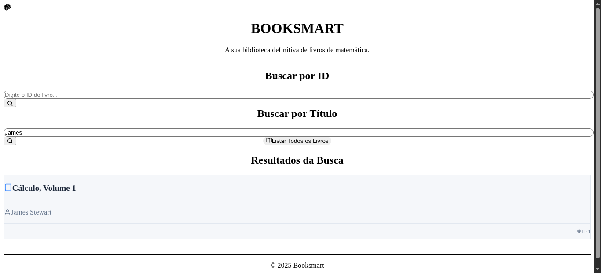
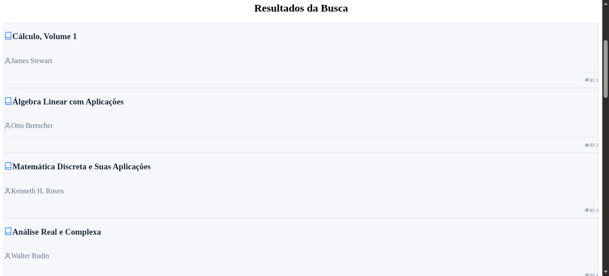

# 📚 BookSmart

> Aplicação Full Stack desenvolvida como Mini Pŕojeto do Módulo 5, com foco na criação de uma API RESTful de livros de matemática e um frontend utilizando Next.js. 
---

### 📌 Índice

* [📖 Sobre o Projeto](#-sobre-o-projeto)
* [🖼️ Imagens do Projeto](#️-imagens-do-projeto)
* [🛠️ Tecnologias Utilizadas](#-tecnologias-utilizadas)
* [🚀 Como Executar o Projeto](#-como-executar-o-projeto)
* [📌 Links Úteis](#-links-úteis)
* [👩‍💻 Autora](#-autora)

---

### 📖 Sobre o Projeto

Vivemos em um mundo com vasta produção de conhecimento, mas o acesso a livros e materiais de estudo ainda é um desafio para muitos. Essa dificuldade limita o potencial de aprendizado e desenvolvimento de estudantes.

Pensando nisso, desenvolvi o **BookSmart**: uma biblioteca virtual com foco exclusivo em livros de matemática, que oferece uma experiência simples, direta e acessível.

Por meio desta aplicação, é possível:

* 🔍 Pesquisar livros por título, autor ou ID
* 📚 Listar todos os livros disponíveis
  
---

### 🖼️ Imagens do Projeto

#### 🔍 Busca por ID


*Busca de um livro específico pelo ID*

#### 🔎 Busca por Título e Autor


*Busca filtrando por nome ou autor*

#### 📋 Listagem Completa


*Listagem completa de todos os livros cadastrados*

---

### 🛠️ Tecnologias Utilizadas

####  Backend 

| Tecnologia    | Versão |
| ------------- | ------ |
| Node.js       | 18.x   |
| Express       | ^5.1.0 |
| CORS          | ^2.8.5 |
| Nodemon (dev) | ^3.1.9 |

####  Frontend 

| Tecnologia    | Versão   |
| ------------- | -------- |
| Next.js       | 14.2.3   |
| React         | ^18      |
| TypeScript    | ^5       |
| Tailwind CSS  | ^3.4.1   |
| Framer Motion | ^11.2.10 |
| React Icons   | ^5.5.0   |

---

### 🚀 Como Executar o Projeto

#### ✅ Pré-requisitos

Antes de começar, instale em sua máquina:

* [Git]
* [Node.js]
* Gerenciador de pacotes: [npm] ou [Yarn]

#### 📅 Clonando o repositório

```bash
# Clone este repositório
git clone https://github.com/MariaJuliaBat/booksmart_frontend.git
```

#### 📆 Instalando dependências

Abra dois terminais:

**Terminal 1 – Backend:**
```bash
# Instalar dependências do backend
cd backend
npm install
```

**Terminal 2 – Frontend:**
```bash
# Instalar dependências do frontend
cd frontend
npm install
```

#### ▶️ Executando a aplicação

**Terminal 1 – Backend:**

```bash
node server.js
```

**Terminal 2 – Frontend:**

```bash
npm run dev
```
---

### 📌 Links Úteis

* 📝 **Apresentação no LinkedIn**: [https://www.linkedin.com/in/mariajuliabatista](https://www.linkedin.com/posts/maria-j%C3%BAlia-batista_desenvolvimentoweb-carreiratech-aprendizadocontaednuo-activity-7348576885817192448-gEw2?utm_source=share&utm_medium=member_desktop&rcm=ACoAAFCQBNYBeQmnPdDjQJDdsA5wcgUkK7JkdH8)
* 🔗 **Repositório da API**: [MariaJuliaBat/MiniProjeto-M4-API](https://github.com/MariaJuliaBat/MiniProjeto-M4-API)

---

### 👩‍💻 Autora

Feito por **Maria Júlia Batista**.

[](https://www.linkedin.com/in/maria-j%C3%BAlia-batista/)

---

### 🌿 Tópicos do Repositório (GitHub Topics)

* `fullstack`
* `api-rest`
* `nextjs`
